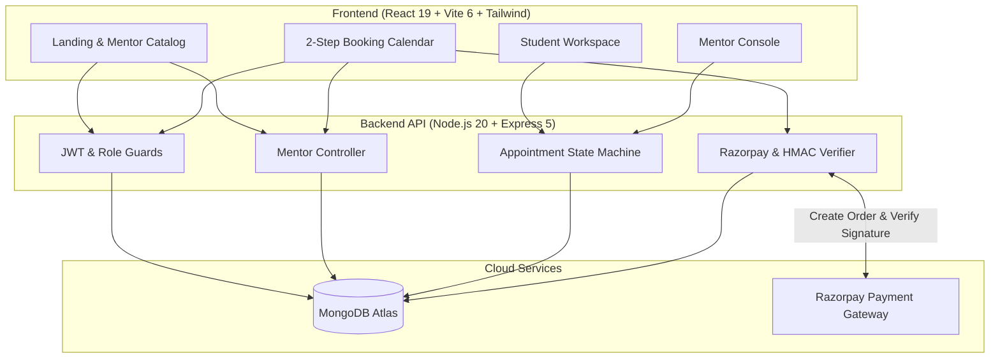

# 🧑‍🏫 MentorSpace — Premier 1-on-1 Tech Mentorship Platform

[](https://reactjs.org/)
[](https://vitejs.dev/)
[](https://tailwindcss.com/)
[](https://nodejs.org/)
[](https://expressjs.com/)
[](https://www.mongodb.com/)
[](https://razorpay.com/)
[](https://mentor-space-phi.vercel.app/)
[](https://mentorspace-backend-p9t8.onrender.com/)
[](https://opensource.org/licenses/ISC)

MentorSpace is a modern, two-role engineering mentorship platform connecting aspiring software developers and university students with senior tech mentors for 1-on-1 online sessions across software engineering, system design, AI/ML, DevOps, and competitive programming.

---

## 🌐 Live Deployments

| Component | Platform | Live URL |
| :--- | :--- | :--- |
| **Frontend Web App** | **Vercel** | [https://mentor-space-phi.vercel.app](https://mentor-space-phi.vercel.app/) |
| **Backend REST API** | **Render** | [https://mentorspace-backend-p9t8.onrender.com](https://mentorspace-backend-p9t8.onrender.com/) |
| **Cloud Database** | **MongoDB Atlas** | `mentorspace` Cluster |

---

## 🌟 Key Features

- **🛡️ Strict 2-Role Security Model** — Platform access is securely partitioned between **Student** and **Mentor** workspaces with role-based JWT authorization guards (`authenticate`, `authorizeStudent`, `authorizeMentor`).
- **🔍 Domain-Based Mentor Discovery** — Filter and search verified tech mentors across 10 specialized engineering domains (React, Node.js, Java, Python, Machine Learning, DevOps, UI/UX, Data Structures, Competitive Programming, and Cloud Computing).
- **💳 HMAC SHA-256 Verified Payments** — Integrated server-side Razorpay order creation (`POST /api/payment/create-order`) and HMAC SHA-256 digital signature validation (`POST /api/payment/verify`) with digital transaction receipts.
- **📅 Interactive 2-Step Booking Flow** — Date selection calendar with visual highlighting, customizable time-slot scheduling (Morning, Afternoon, Evening), and validation.
- **📊 Mentor Console & Session Lifecycle** — Real-time session request management (`Pending` → `Accepted` → `Completed` / `Rejected`) and availability toggles.

---

## 🏗️ System Architecture



---

## 🛠️ Tech Stack

- **Frontend:** React 19, Vite 6, Tailwind CSS, Lucide React, Axios, React Hook Form, Zod
- **Backend:** Node.js 20, Express 5, MongoDB, Mongoose 8, Crypto (HMAC SHA-256), Razorpay SDK, JWT, Bcrypt
- **Database:** MongoDB Atlas (Mongoose ODM)

---

## 🔑 Default Seed Test Accounts

All sample seeded accounts share the default password: **`Admin123@`**

| Role | Email | Domain / Description |
| :--- | :--- | :--- |
| **Mentor** | `sarahchen@mentorspace.com` | React & Frontend Architecture |
| **Mentor** | `alexkumar@mentorspace.com` | Backend & Distributed Systems |
| **Student** | `rahul@student.com` | Active Student Account |

---

## 📡 API Endpoints Summary

| Module | Endpoint | Description |
| :--- | :--- | :--- |
| **Auth** | `POST /api/auth/register` | Register new user with role (`student` or `mentor`) |
| **Auth** | `POST /api/auth/login` | Login user and retrieve JWT token |
| **User** | `GET /api/user` | Fetch current authenticated user profile |
| **Mentors** | `GET /api/mentor` | List all active mentors by domain |
| **Mentors** | `GET /api/mentor/:id` | Get detailed mentor profile |
| **Mentors** | `PUT /api/mentor/profile` | Update mentor availability and bio |
| **Appointments** | `POST /api/appointment` | Book 1-on-1 mentorship session |
| **Appointments** | `PUT /api/appointment/:id`| Update session status (`accepted`, `completed`, `rejected`) |
| **Services** | `GET /api/services` | Retrieve structured mentorship tracks |
| **Payments** | `POST /api/payment/create-order` | Generate server-side Razorpay order ID |
| **Payments** | `POST /api/payment/verify` | Verify HMAC SHA-256 signature and generate receipt |

---

## 🚀 Local Development Setup

### 1. Prerequisites
- **Node.js**: `v20.20.2` (use `nvm use 20.20.2`)
- **MongoDB**: Local MongoDB instance or MongoDB Atlas URI
- **Git**

### 2. Environment Variables Setup

#### Root / Server (`.env` or `server/.env`)
```env
PORT=8000
MONGO_URL=mongodb://127.0.0.1:27017/mentorspace
JWT_SECRET=mentorspace_jwt_secret_key_2026
RAZORPAY_KEY_ID=rzp_test_TImK53NPdBihRw
RAZORPAY_KEY_SECRET=wx3HHLMfmYXPvO9dbxCTILK2
RATE_LIMIT_ENABLED=true
```

#### Client (`client/.env`)
```env
VITE_API_URL=http://localhost:8000/api
VITE_RAZORPAY_KEY_ID=rzp_test_TImK53NPdBihRw
```

### 3. Installation & Run

```bash
# Install dependencies
npm install

# Seed database with 10 mentors and tracks
npm run seed

# Start both Express backend (port 8000) & Vite frontend (port 5173) concurrently
npm run dev
```

---

## 📄 License
This project is licensed under the [ISC License](LICENSE).
